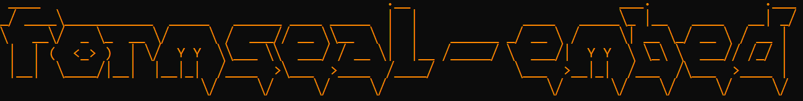

<p align="center">
  
</p>

<p align="center">
  
  
  
  
</p>
<p align="center">
  
</p>

<p align="center">
  A server-blind, browser-native encrypted form poster.
</p>

---

Form submissions are encrypted in the browser using X25519 sealed boxes before reaching any endpoint. The backend receives and stores opaque ciphertext only. Decryption is operator-controlled.

formseal is not a hosted service, dashboard, or SaaS product. It is a drop-in client-side utility.

---

## Installation

**Via npm (recommended)**

```bash
npm install -g @formseal/embed
fse init
```

**Via GitHub release (zero toolchain)**

1. Download the latest [release artifact](https://github.com/grayguava/formseal-embed/releases)
2. Unzip → drop `formseal-embed/` into your project
3. Edit `fse.config.js` manually

> Prefer not to install globally? `npx @formseal/embed init` works, but subsequent `fse` commands won't be available — you'll need to edit `fse.config.js` manually.

---

## Configure

```bash
fse configure quick
```

You'll be prompted for your POST endpoint and public key. See [Getting started](./docs/getting-started.md) for key generation.

---

## Security guarantee

> If the POST endpoint is fully compromised, seized, or maliciously operated, previously submitted form data remains confidential.

Encryption happens in the browser. The backend stores ciphertext only. Decryption keys never exist in the backend environment. A backend compromise yields no recoverable plaintext.

---

## Threat model

formseal is for environments where:

- The hosting provider or backend may be compromised
- The backend must be treated as hostile
- Data seizure is a realistic concern
- Retroactive disclosure must be prevented

The priority is **backward confidentiality** — protecting already-submitted data — not convenience or real-time administration.

---

## How it works

On submit, formseal:

1. Collects field values from your form by `name` attribute
2. Validates them against your field rules (in `fields.jsonl`)
3. Seals the payload with `crypto_box_seal` (Curve25519 + XSalsa20-Poly1305)
4. POSTs raw ciphertext to your configured endpoint

Your endpoint stores the ciphertext. Only the holder of the private key can decrypt it.

---

## Wire up your HTML

> After `fse init`, files live in `./formseal-embed/`. Reference them via your server's static path (e.g. `/formseal-embed/globals.js`).

```html
<form id="contact-form">

  <!-- honeypot — hide off-screen with CSS -->
  <input type="text" name="_hp" tabindex="-1" autocomplete="off"
    style="position:absolute;left:-9999px;opacity:0;height:0;">

  <input type="text"  name="name">
  <span data-fse-error="name"></span>

  <input type="email" name="email">
  <span data-fse-error="email"></span>

  <textarea name="message"></textarea>
  <span data-fse-error="message"></span>

  <button type="submit" id="contact-submit">Send message</button>
</form>

<div id="contact-status"></div>

<script>
  window.fseCallbacks = {
    onSuccess: () => document.getElementById('contact-status').textContent = 'Sent securely.',
    onError:   (err) => console.error('formseal error:', err),
  };
</script>

<script src="/formseal-embed/globals.js"></script>
```

---

## Payload format

```json
{
  "version": "fse.v1.0",
  "origin": "contact-form",
  "id": "<uuid>",
  "submitted_at": "<iso8601>",
  "data": {
    "name": "...",
    "email": "...",
    "message": "..."
  }
}
```

The entire object is sealed with `crypto_box_seal`. Your endpoint receives raw ciphertext as the request body.

> No IP, no timezone, no fingerprints — just the data you explicitly collect.

---

## Field configuration

Fields are defined in `fields.jsonl` (one JSON object per line):

```
{"name": {"required": true, "maxLength": 100}}
{"email": {"required": true, "type": "email"}}
{"message": {"required": true, "maxLength": 1000}}
```

Use the CLI to manage fields:

```bash
fse configure field add phone type:tel required:false
fse configure field required name true
fse configure field maxLength message 500
fse configure field remove company
```

---

## CSS hooks

| Selector | When |
|---|---|
| `[data-fse-error="field"]` | Populated with a validation error |
| `[aria-invalid="true"]` | Set on invalid inputs |
| `[data-fse-status="success"]` | Set on status element on success |
| `[data-fse-status="error"]` | Set on status element on error |

---

## What formseal does not do

- No admin dashboard or inbox UI
- No hosted service
- No bundled decryption tools (yet)
- No npm dependencies at runtime

These are intentional.

---

## Documentation

- [Getting started](./docs/getting-started.md)
- [Concepts → How it works](./docs/concepts/how-it-works.md)
- [Concepts → Security](./docs/concepts/security.md)
- [Integration → HTML](./docs/integration/html.md)
- [Integration → Fields](./docs/integration/fields.md)
- [Integration → JavaScript](./docs/integration/javascript.md)
- [Deployment → Endpoint](./docs/deployment/endpoint.md)
- [Deployment → Decryption](./docs/deployment/decryption.md)
- [Deployment → Versioning](./docs/deployment/versioning.md)

---

## License

MIT